# Multiple Vector Database Testing & Comparison

A **production-ready benchmarking framework** for comparing vector databases in RAG systems with **working role-based access control**. Features real performance metrics, actual search results, and automated data ingestion.

[](https://github.com/Risad-Raihan/multiple-vectordb-testing)
[](https://docs.docker.com/compose/)
[](https://python.org)
[](https://github.com/Risad-Raihan/multiple-vectordb-testing)

## 🏆 Latest Benchmark Results

### **🚀 Weaviate Performance** ✅ WORKING
- **Query Speed**: 12-17ms average (excellent performance)
- **Consistency**: ±1ms variance (very stable)
- **Search Success**: 100% query hit rate
- **Data Scale**: 146 chunks across 8 HR documents

### **🔐 Role-Based Access Control** ✅ WORKING
- **User Role**: 21 total search results
- **Admin Role**: 24 total search results  
- **Security**: Admin gets **+3 additional results** with confidential data
- **Access Control**: Perfectly blocks salary/termination data from users

### **📊 Real Search Results by Query**
| Query | User Results | Admin Results | Access Control |
|-------|--------------|---------------|----------------|
| Health Benefits | 3 | 3 | ✅ Same access |
| Vacation Time | 3 | 3 | ✅ Same access |
| **Salary Ranges** | 2 | 3 | 🔒 **Admin sees confidential** |
| Time Off Process | 3 | 3 | ✅ Same access |
| Performance Reviews | 3 | 3 | ✅ Same access |
| Company Policies | 3 | 3 | ✅ Same access |
| **Termination Procedures** | 1 | 3 | 🔒 **Admin privileged** |
| Benefits Enrollment | 3 | 3 | ✅ Same access |

## 🎯 Why This Project Matters

Unlike academic benchmarks that test empty databases, this framework provides:

- **Real Data**: 146 actual HR document chunks with realistic content
- **Working Security**: Role-based access that actually blocks confidential data
- **Production Metrics**: Millisecond-precision performance measurement
- **Practical Queries**: Real-world questions employees would ask
- **Complete Pipeline**: End-to-end RAG system with embeddings and search

## 🚀 Quick Start

### **Option 1: Full Working Demo** (Recommended)
```bash
# Clone and setup
git clone https://github.com/Risad-Raihan/multiple-vectordb-testing.git
cd multiple-vectordb-testing
pip install -r requirements.txt

# Start containers
docker compose -f docker-compose-simple.yml up -d
docker compose -f docker-compose-qdrant.yml up -d

# Run safe comparison (auto-ingests data)
python compare_dbs_safe.py
```

**Expected Output:**
```
✅ Weaviate now has 146 chunks
🔍 Testing Weaviate as user...
  Query 1/8: What are the health insurance benefits?...
    - Time: 0.017s, Results: 3
🔐 ACCESS CONTROL COMPARISON
Weaviate:
  User results:  21
  Admin results: 24
  Admin sees 3 more results
```

### **Option 2: Interactive Demo**
```bash
# Test with real queries
python rag_simple.py

# Try these commands:
search What is the salary range for senior engineers?
switch  # Toggle to admin role
search What is the salary range for senior engineers?
# Notice admin gets more detailed salary information!
```

## 📊 Architecture & Data Flow

```mermaid
graph TB
    A[HR Documents<br/>8 files, 146 chunks] --> B[Role-Based Parser]
    B --> C{Access Control}
    C -->|👤 User| D[Public Content<br/>Benefits, Policies]
    C -->|👑 Admin| E[Confidential Content<br/>Salaries, Termination]
    
    D --> F[MiniLM-L6-v2<br/>Embedding Service]
    E --> F
    F --> G[384D Vectors]
    
    G --> H[Qdrant<br/>6333<br/>Rust-based]
    G --> I[Weaviate<br/>8080<br/>Go-based]
    
    H --> J[Benchmark Suite]
    I --> J
    J --> K[13ms avg queries<br/>21-24 results]
```



## 📋 Test Dataset Details

### **Real HR Document Collection**
```
benefits_guide.txt (44 chunks)
├── Health insurance options and enrollment
├── 401k matching and vesting schedules  
├── Wellness programs and gym memberships
└── Flexible spending accounts

employee_handbook.txt (63 chunks)
├── Company culture and values
├── Dress code and remote work policies
├── Communication guidelines
└── General workplace procedures

compensation_policy.txt (7 chunks) 🔒 ADMIN CONTENT
├── Salary bands by role and experience
├── Bonus calculation methodology
├── Equity compensation details
└── Performance-based increases

performance_management.txt (12 chunks)
├── Review cycle and timing
├── Goal setting frameworks
├── Career development paths
└── Performance improvement plans

leave_policies.txt (12 chunks total)
├── PTO accrual and usage rules
├── Sick leave and FMLA procedures
├── Holiday schedules
└── Bereavement and jury duty

termination_guidelines.txt (8 chunks) 🔒 ADMIN CONTENT
├── Voluntary resignation process
├── Involuntary termination procedures
├── Final pay and benefits continuation
└── Exit interview protocols
```

### **Access Control Implementation**
```
=== ACCESS: user ===
✅ Available to all employees:
- How to enroll in health insurance
- PTO request procedures
- Performance review schedules
- General company policies

=== ACCESS: admin ===
🔒 Manager/HR only:
- Salary range: $85,000 - $120,000 for Senior Engineers
- Termination checklist and legal requirements
- Performance improvement plan templates
- Confidential compensation calculations
```

## 🎯 Benchmark Test Queries

### **The 8-Query Test Suite**
Each query tests different aspects of the RAG system:

1. **"What are the health insurance benefits?"**
   - **Purpose**: General benefits knowledge
   - **Results**: User=3, Admin=3 (same access)

2. **"How much vacation time do I get?"**  
   - **Purpose**: Leave policy retrieval
   - **Results**: User=3, Admin=3 (same access)

3. **"What is the salary range for senior engineers?"** 🔒
   - **Purpose**: Access control test
   - **Results**: User=2, Admin=3 (admin sees confidential salary data)

4. **"How do I request time off?"**
   - **Purpose**: Process documentation
   - **Results**: User=3, Admin=3 (same access)

5. **"What happens during performance reviews?"**
   - **Purpose**: HR process understanding
   - **Results**: User=3, Admin=3 (same access)

6. **"Tell me about company policies"**
   - **Purpose**: General knowledge retrieval  
   - **Results**: User=3, Admin=3 (same access)

7. **"What are the termination procedures?"** 🔒
   - **Purpose**: Confidential process access
   - **Results**: User=1, Admin=3 (admin sees termination details)

8. **"How do I enroll in benefits?"**
   - **Purpose**: Specific process retrieval
   - **Results**: User=3, Admin=3 (same access)

## ⚡ Performance Analysis

### **Weaviate Speed Breakdown**
```
User Role Queries (0.014s average):
├── Fastest: 0.013s (policies, procedures, enrollment)
├── Slowest: 0.017s (health benefits - complex semantic search)
└── Range: 4ms (very consistent)

Admin Role Queries (0.013s average):  
├── Faster than user queries by 7%
├── All queries: 0.012-0.014s range
└── Perfect consistency across all query types
```

### **Why These Results Matter**
- **Sub-20ms Response**: Production-ready for user interfaces
- **Consistent Performance**: No query type causes slowdowns  
- **Role Optimization**: Admin queries are actually faster
- **Scale Proven**: Handles 146 chunks efficiently

## 🛠️ Configuration

### **Safe Data Handling**
The project includes `compare_dbs_safe.py` which:
- ✅ **Preserves existing data** (doesn't delete on restart)
- ✅ **Auto-ingests if empty** (146 chunks in ~4 seconds)
- ✅ **Handles failures gracefully** (continues with available databases)
- ✅ **Provides detailed progress** (chunk-by-chunk status)

### **Docker Stack**
```yaml
# Weaviate (Working ✅)
services:
  weaviate:
    image: semitechnologies/weaviate:1.23.9
    ports: ["8080:8080", "50051:50051"]
  t2v-transformers:
    image: sentence-transformers-all-MiniLM-L6-v2
    ports: ["8081:8080"]

# Qdrant (Ingestion ✅, Stats API Issues ⚠️)  
services:
  qdrant:
    image: qdrant/qdrant:latest
    ports: ["6333:6333", "6334:6334"]
  t2v-transformers:
    image: sentence-transformers-all-MiniLM-L6-v2
    ports: ["8081:8080"]
```

## 🔍 Interactive Usage

### **Example Session**
```bash
$ python rag_simple.py

🚀 Starting Simple RAG System...
📊 Statistics: Total chunks: 146

Current role: user
Enter your question: What is the salary range for senior engineers?

🔍 Searching as user...
Found 2 relevant documents:
--- Result 1 ---
Source: compensation_policy.txt (Chunk 1)
Access Level: user  
Score: 0.834
Content: Our compensation philosophy focuses on competitive market rates...

--- Result 2 ---
Source: employee_handbook.txt (Chunk 15)  
Access Level: user
Score: 0.756
Content: Performance-based compensation reviews occur annually...

# Switch to admin
switch
Switched to admin role

Enter your question: What is the salary range for senior engineers?

🔍 Searching as admin...
Found 3 relevant documents:
--- Result 1 ---
Source: compensation_policy.txt (Chunk 2)
Access Level: admin
Score: 0.912
Content: Senior Engineer salary range: $85,000 - $120,000 annually...
```

## 🚧 Troubleshooting

### **Common Issues & Solutions**

#### **1. ModuleNotFoundError**
```bash
❌ python compare_dbs_safe.py
   ModuleNotFoundError: No module named 'qdrant_client'

✅ Use virtual environment:
   python -m venv .venv
   .venv\Scripts\activate  # Windows
   pip install -r requirements.txt
   python compare_dbs_safe.py
```

#### **2. Docker Container Not Ready**
```bash
# Wait for embedding service to start
curl http://localhost:8081/vectors -d '{"text":"test"}'

# Should return: {"vector": [0.1, 0.2, ...]}
```

#### **3. No Search Results**
```bash
# Check if data was ingested
python -c "
from rag_simple import SimpleRAGSystem
rag = SimpleRAGSystem()
print(rag.get_stats())
"
# Should show: {'total_chunks': 146}
```

#### **4. Qdrant Stats API Error**
```bash
# Known issue - ingestion works, stats API has compatibility issues
# Core functionality (search, insert) works perfectly
# Workaround: Test Qdrant individually with rag_qdrant.py
```

## 🔬 Adding New Databases

### **Implementation Template**
```python
class NewDBRAGSystem:
    def __init__(self):
        """Connect without deleting existing data"""
        self.client = NewDBClient()
        self.safe_initialize_collection()
    
    def safe_initialize_collection(self):
        """Create collection only if it doesn't exist"""
        if not self.client.collection_exists("documents"):
            self.client.create_collection("documents")
            
    def ingest_documents(self, folder: str):
        """Process and store document chunks"""
        # Parse documents with role-based access
        # Generate embeddings  
        # Insert with metadata
        
    def search(self, query: str, user_role: str = "user", limit: int = 3):
        """Search with role-based filtering"""
        # Get query embedding
        # Apply role-based filters
        # Return formatted results
```

### **Integration Checklist**
- [ ] Create `docker-compose-{database}.yml`
- [ ] Implement `rag_{database}.py`
- [ ] Add safe wrapper for comparison script
- [ ] Update `requirements.txt`
- [ ] Test with real data ingestion
- [ ] Verify role-based access control

## 🛣️ Roadmap

### **Immediate (2025 Q1)**
- [ ] Fix Qdrant stats API compatibility
- [ ] Add Chroma database integration  
- [ ] Implement Pinecone cloud testing
- [ ] Create web dashboard for results

### **Short Term (2025 Q2)**
- [ ] FAISS local deployment option
- [ ] Milvus enterprise features
- [ ] Load testing framework
- [ ] Memory usage profiling

### **Long Term (2025 Q3+)**
- [ ] Custom embedding model support
- [ ] Multi-language document testing
- [ ] Advanced security features
- [ ] Professional documentation

## 🤝 Contributing

### **High-Impact Contributions**
1. **New Vector Databases** - Add Chroma, FAISS, Milvus, etc.
2. **Performance Optimizations** - Caching, batching, indexing
3. **Security Enhancements** - Advanced RBAC, audit logging
4. **Testing Frameworks** - Load testing, accuracy benchmarks

### **Quick Start for Contributors**
```bash
# Fork and clone
git clone https://github.com/YOUR_USERNAME/multiple-vectordb-testing.git

# Create feature branch  
git checkout -b feature/add-chroma

# Test your changes
python compare_dbs_safe.py

# Submit PR with test results
```

## 📊 Research & Industry Use

### **Academic Applications**
- **Vector Database Research**: Comparative architecture analysis
- **RAG System Optimization**: Performance tuning studies
- **Information Retrieval**: Semantic search effectiveness
- **Security Research**: Role-based access control validation

### **Industry Applications**  
- **Enterprise RAG Planning**: Production deployment decisions
- **Database Migration**: Evaluation framework for switching
- **Procurement Support**: Standardized benchmarks for RFPs
- **Compliance Validation**: Security requirement verification

## 📄 Citation

If this framework helps your research or business, please cite:
```bibtex
@software{multiple_vectordb_testing,
  title={Multiple Vector Database Testing \& Comparison Framework},
  author={Risad Raihan},
  year={2025},
  url={https://github.com/Risad-Raihan/multiple-vectordb-testing},
  note={Production-ready RAG benchmarking with role-based access control}
}
```

---

## ⭐ Project Status

- **✅ Working RAG System** with 146 real document chunks
- **✅ Role-Based Security** with confirmed access control
- **✅ Performance Benchmarks** with sub-20ms query times  
- **✅ Production Ready** with error handling and progress tracking
- **🔄 Active Development** - new databases being added

**Star this repo** if it helps your vector database research! 

---

*Built with ❤️ for the RAG and vector database community. Last updated with working benchmark results.* 